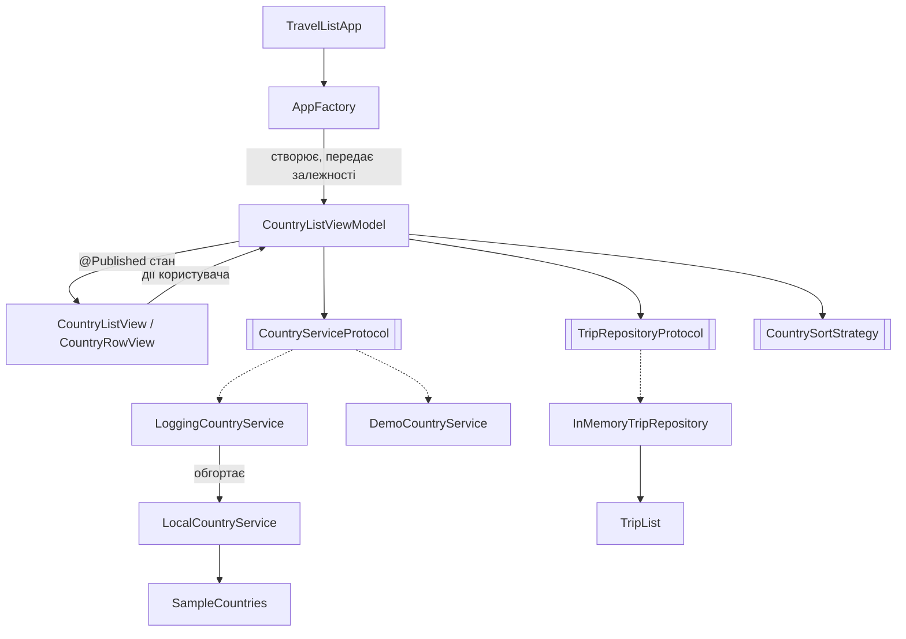

# Архітектура TravelList

## Обрана архітектура: MVVM

Застосунок невеликий: кілька екранів, локальне джерело даних, а в ПР4 — мережевий сервіс. MVVM добре поєднується зі SwiftUI: `View` підписується на `@Published`-властивості `ViewModel` і оновлюється автоматично. VIPER для такого обсягу дав би забагато шаблонного коду, а в MVC контролер у SwiftUI фактично зливається з `View`.

**Обмеження:** `ViewModel` може розростатися, якщо складати в неї всю логіку, тому доступ до даних винесено в окремі сервіси. MVVM не визначає, хто керує навігацією, — для цього в ПР3 буде окремий компонент.

## Схема компонентів



Суцільна стрілка — використання, пунктирна — реалізація протоколу.

| Шар | Файли | Відповідальність |
|---|---|---|
| Model | `Models/` | Дані та бізнес-правила (`Country`, `TripItem`, `TripList`) |
| View | `Views/` | Відображення стану й передача дій користувача у `ViewModel` |
| ViewModel | `ViewModels/CountryListViewModel.swift` | Стан екрана, фільтрація, сортування, додавання до списку |
| Services | `Services/` | Отримання країн і зберігання списку подорожей |
| Composition | `App/AppFactory.swift` | Створення об'єктів і передавання залежностей |

## Сценарій, що проходить через архітектуру

1. `CountryListView` під час появи викликає `viewModel.load()`.
2. `CountryListViewModel` отримує країни через `CountryServiceProtocol`.
3. Користувач обирає регіон або сортування — `ViewModel` застосовує фільтр і стратегію, `View` оновлюється.
4. Натискання ❤️ викликає `toggleTrip`, `ViewModel` змінює `TripRepositoryProtocol` і оновлює лічильник.

## Патерни

| Патерн | Категорія | Компонент | Призначення |
|---|---|---|---|
| Factory | Породжувальний | `App/AppFactory.swift` | Створює `ViewModel` і збирає залежності в одному місці. `live()` і `demo()` задають різні набори сервісів |
| Decorator | Структурний | `Services/LoggingCountryService.swift` | Обгортає будь-який `CountryServiceProtocol` і додає логування, не змінюючи сам сервіс |
| Strategy | Поведінковий | `Services/CountrySortStrategy.swift` | Алгоритми сортування (`SortByName`, `SortByPopulation`, `SortByArea`) взаємозамінні, `ViewModel` обирає потрібний |
| Observer | Поведінковий | `CountryListViewModel` (`ObservableObject`, `@Published`) | `View` підписана на зміни стану й перемальовується автоматично |

**Учасники:**
- **Factory:** клієнт — `TravelListApp`, фабрика — `AppFactory`, продукт — `CountryListViewModel`.
- **Decorator:** компонент — `CountryServiceProtocol`, декоратор — `LoggingCountryService`, обгорнутий об'єкт — `LocalCountryService`.
- **Strategy:** контекст — `CountryListViewModel`, стратегія — `CountrySortStrategy`, конкретні стратегії — `SortByName`, `SortByPopulation`, `SortByArea`.

## SOLID

| Принцип | Як застосовано |
|---|---|
| **S** — єдина відповідальність | `View` тільки відображає, `ViewModel` керує станом, `LocalCountryService` постачає дані, `InMemoryTripRepository` зберігає список, `AppFactory` створює об'єкти |
| **O** — відкритість/закритість | Нове сортування — новий тип `CountrySortStrategy` без змін у `ViewModel`. Логування додано декоратором без змін у `LocalCountryService` |
| **L** — підстановка Лісков | `LocalCountryService`, `DemoCountryService`, `LoggingCountryService` взаємозамінні там, де очікується `CountryServiceProtocol` |
| **I** — розділення інтерфейсів | Два вузькі протоколи: `CountryServiceProtocol` (отримання країн) і `TripRepositoryProtocol` (список подорожей) замість одного «менеджера даних» |
| **D** — інверсія залежностей | `CountryListViewModel` залежить від протоколів, а не від конкретних класів. Реалізації передаються ззовні через `init` (Dependency Injection) |

## Заміна залежності

`ViewModel` не знає, яка реалізація сервісу їй передана. Щоб замінити джерело даних на демонстраційне, достатньо змінити один рядок у `App/TravelListApp.swift`:

```swift
private let factory = AppFactory.demo()
```

Так само `AppFactory.demo()` використовується в `#Preview` у `CountryListView.swift`. Код `CountryListViewModel` при цьому не змінюється.

## Перевірка на антипатерни

| Проблема | Як було | Як виправлено |
|---|---|---|
| Пряме поєднання UI з даними | У ПР1 `ContentView` сам створював сценарій і звертався до даних | `View` працює тільки через `ViewModel`, дані — через сервіси |
| Прихована глобальна залежність | `SampleCountries.all` можна було викликати з будь-якого місця | Доступ до `SampleCountries` є тільки в `LocalCountryService`, яка передається через протокол |
| Надмірна відповідальність | — | Сортування винесено в стратегії, логування — в декоратор, створення об'єктів — у фабрику |
| Дублювання | — | Фільтрація й сортування зібрані в одному методі `applyFilters()` |
