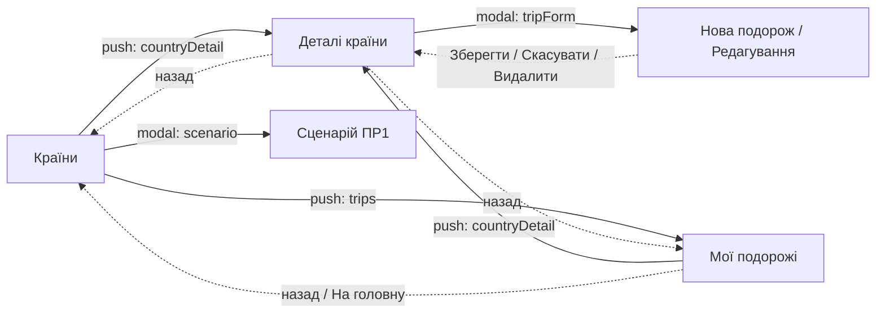

# Практична робота 3. Інтерфейс, навігація та анімації

## Екрани

| Екран | Файл | Призначення |
|---|---|---|
| Країни | `Views/CountryListView.swift` | Список країн, фільтр за регіоном, сортування, додавання ❤️ |
| Деталі країни | `Views/CountryDetailView.swift` | Інформація про країну та її статус у списку подорожей |
| Нова подорож / Редагування (модальний) | `Views/TripFormView.swift` | Створення або редагування запису: статус і нотатка |
| Мої подорожі | `Views/TripsView.swift` | Збережені країни, згруповані за статусом |
| Сценарій ПР1 (модальний) | `Views/ScenarioLogView.swift` | Демонстрація сценарію з ПР1 |

## Карта навігації

Суцільна стрілка — перехід, пунктирна — повернення.

## Керування навігацією

Навігація винесена з екранів в окремий шар `Navigation/`:

| Компонент | Відповідальність |
|---|---|
| `Route` | Маршрути стекової навігації: `.countryDetail(Country)`, `.trips` |
| `SheetRoute` | Модальні маршрути: `.tripForm(Country)`, `.scenario` |
| `AppRouter` | Стан навігації: `path` (стек) і `sheet` (модальне вікно). Методи `push`, `pop`, `popToRoot`, `present`, `dismissSheet` |
| `AppCoordinatorView` | Містить `NavigationStack(path:)`, за маршрутом створює потрібний екран через `AppFactory` і передає йому `ViewModel` |

Екрани не створюють інші екрани напряму: вони викликають `router.push(...)` або `router.present(...)`. Роутер передається через `@EnvironmentObject`.

## Передавання даних

- На екран деталей передається сутність `Country` у маршруті `.countryDetail(Country)`.
- У модальну форму передається `Country` у маршруті `.tripForm(Country)`. `TripFormViewModel` сам визначає режим: якщо країна вже є у списку — редагування, інакше — створення.
- Після збереження форма викликає `TripRepositoryProtocol.save(...)`. Репозиторій надсилає оновлений список через `itemsPublisher` (Combine), і всі підписані `ViewModel` оновлюються:
  - `CountryDetailViewModel` — картка статусу на екрані деталей;
  - `CountryListViewModel` — ❤️ і лічильник на головному екрані;
  - `TripsViewModel` — список «Мої подорожі».
- Підписки використовують `[weak self]`, тому між `ViewModel` і репозиторієм немає циклу сильних посилань.

## Стан інтерфейсу

- `CountryListViewModel` належить `AppCoordinatorView` (`@StateObject`), тому фільтр, сортування й позиція списку зберігаються після повернення з інших екранів.
- Дані на головному екрані завантажуються один раз (`loadIfNeeded()`), повернення назад не скидає стан.
- `ViewModel` екранів деталей, форми й списку подорожей створюються один раз для кожного відкриття (`@StateObject`).

## Анімації

| Анімація | Де | Що відбувається |
|---|---|---|
| Розгортання деталей | `CountryDetailView`, кнопка «Детальніше» | Додаткові поля з'являються з анімацією `spring` (зсув + прозорість), стрілка повертається на 180° |
| Зміна статусу | `CountryDetailView`, картка подорожі | Після збереження/видалення картка статусу змінюється з анімацією масштабу та прозорості |
| Кнопка ❤️ | `CountryRowView` | При додаванні серце збільшується з пружинною анімацією та змінює колір |

Анімації короткі (0,25–0,45 с) і не блокують натискання: під час анімації можна далі взаємодіяти з екраном.

## Перевірка інтерфейсу

| Перевірка | Як забезпечено |
|---|---|
| Два розміри екрана | Симулятори iPhone SE (3rd generation) і iPhone 16 Pro Max |
| Текст не перекривається | Екран деталей у `ScrollView`, назва країни з `minimumScaleFactor`, нотатки переносяться на кілька рядків |
| Клавіатура не заважає | Кнопка «Зберегти» у навігаційній панелі завжди видима; клавіатуру можна сховати свайпом (`scrollDismissesKeyboard`) або кнопкою «Готово» над клавіатурою |
| Повторні переходи | Один і той самий екран деталей можна відкрити зі списку країн і зі списку подорожей; стан оновлюється в обох місцях |
| Коректне повернення | Кнопка «Назад» і «На головну» (`popToRoot`) повертають без втрати стану |

## Сценарій перевірки

1. Запустити застосунок (⌘R).
2. На екрані «Країни» натиснути на Японію — відкриються деталі.
3. Натиснути «Детальніше» — додаткові поля розгорнуться з анімацією.
4. Натиснути «Додати до подорожей» — відкриється модальна форма.
5. Обрати статус, ввести нотатку, натиснути «Зберегти» — на екрані деталей з'явиться картка статусу.
6. Повернутися назад — біля Японії ❤️ заповнене, лічильник унизу збільшився.
7. Натиснути 🧳 (або лічильник унизу) — відкриється «Мої подорожі» з Японією.
8. Натиснути на Японію → «Редагувати» → змінити статус на «Відвідано» → «Зберегти». Повернутися назад — Японія перемістилася в розділ «Відвідано».
9. Натиснути «На головну» — повернення до списку країн, фільтр і сортування збережені.
