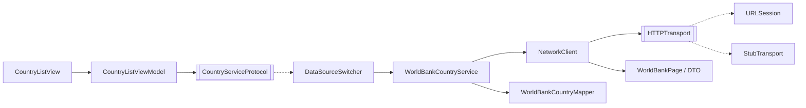

# Практична робота 4. Взаємодія із сервером та обробка даних

## Джерело даних: World Bank API

Відкрите API Світового банку з даними про країни. Відповідає темі застосунку: назва, столиця, регіон, населення та площа країни.

| Параметр | Значення |
|---|---|
| Базова адреса | `https://api.worldbank.org/v2` |
| Авторизація | Не потрібна |
| Метод | `GET` |
| Формат відповіді | JSON (`format=json`) |

**Endpoint-и:**

| Endpoint | Параметри | Що повертає |
|---|---|---|
| `/country` | `format=json`, `per_page=400` | Список країн: код, назва, регіон, столиця |
| `/country/all/indicator/SP.POP.TOTL` | `format=json`, `per_page=400`, `mrnev=1` | Населення країн (останнє доступне значення) |
| `/country/all/indicator/AG.SRF.TOTL.K2` | `format=json`, `per_page=400`, `mrnev=1` | Площа країн, км² |

**Формат відповіді** — масив із двох елементів: метадані сторінки та масив записів.

```json
[
  {"page": 1, "pages": 1, "per_page": "400", "total": 295},
  [
    {
      "id": "ABW",
      "iso2Code": "AW",
      "name": "Aruba",
      "region": {"id": "LCN", "value": "Latin America & Caribbean "},
      "capitalCity": "Oranjestad"
    }
  ]
]
```

```json
[
  {"page": 1, "pages": 1, "per_page": 400, "total": 264},
  [
    {"countryiso3code": "AFE", "date": "2025", "value": 788844284}
  ]
]
```

Записи з регіоном `Aggregates` (групи країн, наприклад «Arab World») відфільтровуються. Прапор формується з двобуквеного коду `iso2Code`.

## Мережевий шар

| Компонент | Файл | Відповідальність |
|---|---|---|
| `Endpoint`, `WorldBankEndpoint` | `Networking/WorldBankEndpoint.swift` | Формування `URLRequest`: адреса, параметри, метод, заголовки |
| `HTTPTransport` | `Networking/NetworkClient.swift` | Протокол відправлення запиту. `URLSession` реалізує його через `data(for:)` |
| `NetworkClient` | `Networking/NetworkClient.swift` | Виконує запит, перевіряє HTTP-статус, декодує JSON, класифікує помилки |
| `NetworkError` | `Networking/NetworkError.swift` | Типи помилок і зрозумілі повідомлення для користувача |
| `WorldBankPage`, DTO | `Networking/WorldBankDTO.swift` | `Decodable`-моделі відповіді сервера |
| `WorldBankCountryMapper` | `Networking/WorldBankCountryMapper.swift` | Перетворення DTO у модель застосунку `Country` (Adapter) |
| `WorldBankCountryService` | `Services/WorldBankCountryService.swift` | Реалізація `CountryServiceProtocol`: три паралельні запити та об'єднання результатів |
| `StubTransport` | `Networking/StubTransport.swift` | Керована заміна мережі для негативних сценаріїв |
| `DataSourceSwitcher` | `Services/DataSourceSwitcher.swift` | Перемикання джерела даних під час роботи застосунку |

Екрани не звертаються до мережі напряму. `CountryListViewModel` залежить лише від `CountryServiceProtocol`, а конкретна реалізація передається ззовні через `AppFactory`.



## Асинхронність і оновлення інтерфейсу

- Запити виконуються через `async/await`. Три запити (країни, населення, площа) запускаються паралельно через `async let`.
- `CountryListViewModel.load()` позначено `@MainActor`: зміни стану, на який підписаний інтерфейс, відбуваються на головному акторі.
- Мережевий запит виконується поза головним потоком, тому інтерфейс не блокується під час очікування.
- Якщо користувач залишає екран під час завантаження, скасування запиту (`CancellationError`) не показується як помилка.

## Стани екрана

`LoadState` у `CountryListViewModel`:

| Стан | Що бачить користувач |
|---|---|
| `loading` | Індикатор «Завантаження країн…» |
| `loaded` | Список країн |
| `empty` | «Немає даних» і кнопка «Повторити» |
| `failed(message)` | «Помилка завантаження», зрозуміле повідомлення і кнопка «Повторити» |

## Обробка помилок

`NetworkClient.get(_:)` розрізняє:

| Помилка | Коли виникає | Повідомлення |
|---|---|---|
| `transport` | Немає мережі, тайм-аут, сервер недоступний (`URLError`) | «Немає з'єднання з сервером…» |
| `httpStatus(code)` | Статус відповіді не в діапазоні 200–299. Перевіряється **до** декодування | «Сервер повернув помилку (код …)…» |
| `decoding` | JSON не відповідає очікуваній структурі | «Не вдалося обробити дані від сервера.» |
| `invalidResponse` | Відповідь не є HTTP-відповіддю | «Сервер повернув некоректну відповідь.» |

## Перевірка станів

На головному екрані кнопка 📡 (угорі праворуч) відкриває меню **Джерело даних**. Після вибору дані завантажуються повторно.

| Пункт меню | Що перевіряється | Реалізація |
|---|---|---|
| Реальне API | Успішний запит до World Bank API | `URLSession` |
| Локальні дані | Робота без мережі на демонстраційних даних | `LocalCountryService` |
| Порожня відповідь | Стан «Немає даних» | `StubTransport` повертає JSON без записів |
| Немає мережі | Транспортна помилка | `StubTransport` кидає `URLError(.notConnectedToInternet)` |
| Помилка сервера 500 | Невдалий HTTP-статус | `StubTransport` повертає статус 500 |
| Некоректний JSON | Помилка декодування | `StubTransport` повертає JSON іншої структури |

Для негативних сценаріїв підмінюється тільки транспорт (`HTTPTransport`). `NetworkClient`, перевірка статусу, декодування й перетворення даних працюють так само, як і з реальним сервером, тому перевірка не залежить від випадкових збоїв зовнішнього API.

**Кроки перевірки:**
1. Запустити застосунок з доступом до інтернету — завантажиться список країн з API (у консолі Xcode: `[CountryService] Отримано країн: …`).
2. 📡 → «Порожня відповідь» — екран «Немає даних».
3. 📡 → «Немає мережі» — повідомлення про відсутність з'єднання, кнопка «Повторити».
4. 📡 → «Помилка сервера 500» — повідомлення з кодом 500.
5. 📡 → «Некоректний JSON» — повідомлення про помилку обробки даних.
6. 📡 → «Реальне API» — дані знову завантажуються з сервера.

Реальну транспортну помилку можна також перевірити, вимкнувши інтернет на Mac і натиснувши «Повторити».

## Запуск

Власний сервер не потрібен: застосунок звертається до публічного API. Достатньо відкрити проєкт у Xcode 16+ і запустити на симуляторі з доступом до інтернету.
